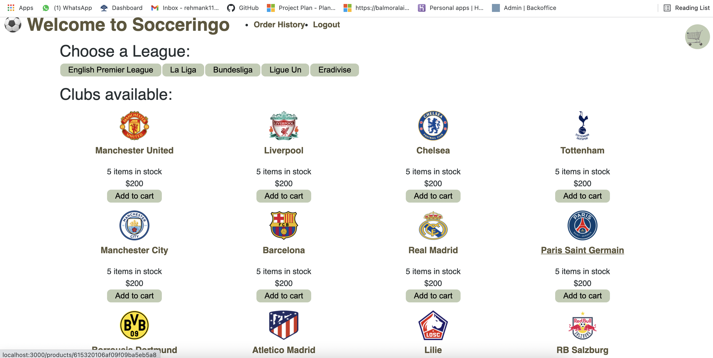

## Talbe of Contents

* [Usage](#usage)
* [Links](#links)
* [Tools](#tools)
* [Credits](#credits)
* [License](#license)
* [User Story](#user-story)
___
## 
## Tools
* JavaScript
* node.js
* MySQL2
* Express.js
* Sequelize
* dotenv
* bcrypt
* connect-session-sequelize
* express-handlebars
* express-session
* HTML & CSS
* UUID
___

## Credits
* Completed by: 
[Abdul Khalil](https://github.com/absk786)
___
## License
[](https://
a new survey
## Usage
The application allows the user to purchase tickets to thier favourite football games in europe. 
### User Story:
```
AS a avid football fan,
I WANT to easily and safely be able to browse football tickets for the teams i like
SO THAT I can add items to my cart for checkout.
```
### Acceptance Test for User Story: 
```
GIVEN an e-commerce website, 
WHEN I open the site,
THEN I am able to see the app’s name, logo, and content. 
WHEN I click on “Create an Account”,
THEN I am directed to creating a new account which will later be saved. 
IF I click the “Sign In’ button and did not previously make an account, 
THEN I will not be able to access any account. 
IF I do not enter a valid username or password,
THEN I will also be unable to access any account. 
WHEN I click on the “Sign In” button and do already have an account, 
THEN I can sign into a previously made account and view saved items. 
IF I chose to browse the website without creating an account, 
THEN I can continue to browse and add items to my cart without creating an 
account. 
BUT I will not be able to proceed to the checkout unless I make an account. 
WHEN I go through the application’s inventory, 
THEN I have the ability to view items based on genre or trending selections 
and see available records for purchase. 
WHEN I click on a club, 
THEN I am given the option to view the tickets for the upcomming matches for the club
WHEN I click on a match, 
THEN I will be shown the available tickets in different areas for that matches. 
WHEN I select on my cart, 
THEN I am able to view the items I have saved for checkout and proceed 
with the order. 
WHEN I go through my cart,
THEN I am able to see my saved items in a list and a total price for all items.
IF I have not placed any items in my cart,
THEN if I click on my cart, it will tell me that it is empty. 
WHEN I navigate through the application on a tablet or smartphone,              
THEN the application is still responsive, and I can still view and save records 
to my cart.
## Description

Users can buy **something** here
## Table of Contents
 * [Website](#website)
 * [Installation](#installation)
 * [Contributing](#contributing)
 * [Screenshots](#screenshots)
 * [Questions](#questions)
 * [License](#license)

 ## Website 

**URL**: 

## Installation
  1. Clone the files from the repository onto your local machine
  2. Navigate to the directory of the cloned repository in your terminal.
  3. At the root directory, type  `npm install`  to install the npm modules
  4. Make sure you have MongoDb installed on your system
  5. In your terminal, at the root directory, run the app by typing:  `npm run develop`

## Screenshots


## Questions
